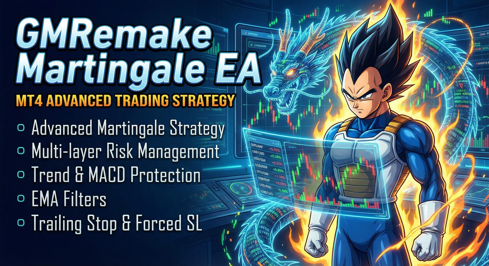

# GMRemake Martingale EA

這是一個為 MetaTrader 4 (MT4) 平台設計的馬丁格爾 (Martingale) 交易策略 EA。

## 專案概覽
GMRemake 是一個進階的馬丁格爾 Expert Advisor (EA)。它實作了多層次的風險管理、趨勢保護以及 EMA 過濾器，旨在優化交易表現並降低傳統馬丁策略的風險。

## 核心功能

### 1. 馬丁格爾策略 (Martingale Strategy)
- **多達 8 層加倉**：支援買入和賣出方向各最多 8 層的馬丁加倉。
- **可配置的入場距離**：每一層加倉都可以設定獨立的點數距離 (Entry Distance)。
- **自定義手數 (Lot Size)**：每一層加倉都可以設定獨立的手數，不一定要依照倍數，可以靈活調整。
- **方向控制**：可以設定只做多 (Buy Only)、只做空 (Sell Only) 或雙向交易。

### 2. 風險管理 (Risk Management)
- **移動止損 (Trailing Stop)**：當整體倉位獲利達到指定點數後，啟動移動止損，鎖定利潤。
- **點差過濾 (Spread Filter)**：在高點差時暫停交易，避免過高的交易成本。
- **滑點控制 (Slippage Control)**：限制訂單執行的最大滑點。
- **最大層數止損**：當達到最大加倉層數後，若價格繼續逆勢達到下一層的距離，將執行強制止損，防止帳戶爆倉。

#### 趨勢保護 (Trend Protection)
- **價格趨勢確認**：在加倉前，要求價格K線必須出現反轉訊號且突破。
  - **買入加倉**：前一根 K 線必須是陽線 (Close > Open) **且** 收盤價高於前前一根的最高價 (Breakout)。
  - **賣出加倉**：前一根 K 線必須是陰線 (Close < Open) **且** 收盤價低於前前一根的最低價 (Breakout)。
- **MACD 趨勢保護**：監控 MACD 指標，避免在強烈的逆勢趨勢中加倉。
  - 可自訂 MACD 參數 (Fast, Slow, Signal)。
  - 可設定背離判斷的 K 線數量 (Divergence Bars)。
- **EMA 過濾器**：雙 EMA (長週期與短週期) 過濾系統，確保交易方向與市場大趨勢一致。

## 詳細策略說明

### 參數說明 (Parameters)

#### 基礎設定
- **Timeframe**: 交易時區 (預設: H1，即一小時圖)。
- **Bars Counted Back**: 判斷首單入場訊號時，回溯參考的 K 線數量 (預設: 20)。
- **Max Buy Order**: 最大買入層數 (0-8，設為 0 則不開買單)。
- **Max Sell Order**: 最大賣出層數 (0-8，設為 0 則不開賣單)。

#### 入場距離 (Entry Distance)
設定每一層加倉所需的逆勢點數距離：
- **Entry Distance 1**: 首單入場的觸發距離 (突破高點/低點多少點)。
- **Entry Distance 2-8**: 第 2 到第 8 層加倉，距離上一張單的點數。
- *單位為 Points (小點)，例如 100 Points = 10 Pips (大點)。*

#### 手數設定 (Lot Size)
設定每一層的手數大小：
- **Lot Size 1-8**: 第 1 到第 8 層的下單手數。
- *建議：新手可使用 0.01, 0.02, 0.04... 的倍增方式，或更保守的 0.01, 0.01, 0.02...*

#### EMA 過濾機制 (EMA Filters)
利用兩條指數移動平均線 (EMA) 來過濾進場訊號：
- **EMA Trend Period (L)**: 長週期 EMA (預設 200)。
- **EMA Trend Filter (L) For Buy/Sell**: 設定價格必須在 EMA 之上或之下多少點才允許交易。
- **EMA Trend Period (S)**: 短週期 EMA (預設 50)。
- *功能：例如設定 "只在價格高於 200 EMA 時做多"，可以避免在空頭趨勢中逆勢做多。*

### 入市策略 (Entry Strategy)

#### 首單入場 (Level 1)
- **買入訊號 (Buy)**：當前價格 **高於** 過去 N 根 K 線的最高點 + Entry Distance 1。
- **賣出訊號 (Sell)**：當前價格 **低於** 過去 N 根 K 線的最低點 - Entry Distance 1。
- *這是一種「突破策略」，意在捕捉趨勢發動的瞬間。*

#### 馬丁加倉 (Level 2-8)
- **買入加倉**：當價格比上一張買單 **下跌** 了指定的 Entry Distance (例如 200 點)。
- **賣出加倉**：當價格比上一張賣單 **上漲** 了指定的 Entry Distance。
- **保護機制**：加倉前會檢查 Trend Protection (K線反轉) 和 MACD Protection，若條件不符則暫緩加倉，等待更安全的時機，避免"接刀"。

### 平倉機制 (Exit Strategy)

#### 移動止損 (Trailing Stop) - 獲利出場
- **Trailing Points (啟動點)**：當整體倉位 (Basket) 的浮動盈虧達到此點數 (例如 100 點) 時，啟動移動止損。
- **Stop Trailing Points (回撤點)**：啟動後，若利潤回吐超過此點數 (例如 50 點)，立即全數平倉出場。
- *這能確保在趨勢延續時賺取更多利潤，而在趨勢反轉時保住大部分獲利。*

#### 強制止損 (Stop Loss) - 認賠出場
- 當持倉層數達到設定的上限 (例如 Max Buy Order = 5)。
- 且價格繼續逆勢運行，達到了原本應該開第 6 層的距離。
- 此時 EA 會判定趨勢錯誤，強制平掉所有倉位，避免虧損無限擴大。

## 安裝說明

1. 下載 `MT4/Experts/GMRemake_v1.0.mq4` (或最新版本) 檔案。
2. 開啟 MT4 平台，點擊「文件」→「打開數據文件夾」。
3. 進入 `MQL4` → `Experts` 資料夾，將檔案貼上。
4. 回到 MT4，在「導航器」面板右鍵點擊「刷新」。
5. 將 `GMRemake_v1.0` 拖曳到圖表上即可使用。

## 風險警告

外匯保證金交易具有高風險，可能不適合所有投資者。使用馬丁格爾策略 (Martingale) 雖然有機會快速獲利，但也伴隨著較大的回撤風險。
- **請務必先在模擬帳戶 (Demo Account) 進行充分測試。**
- **請確保您的帳戶資金足以承受連續加倉的保證金需求。**
- **建議從小手數 (0.01) 開始。**

---
Copyright (c) 2025 GMRemake Martingale EA
